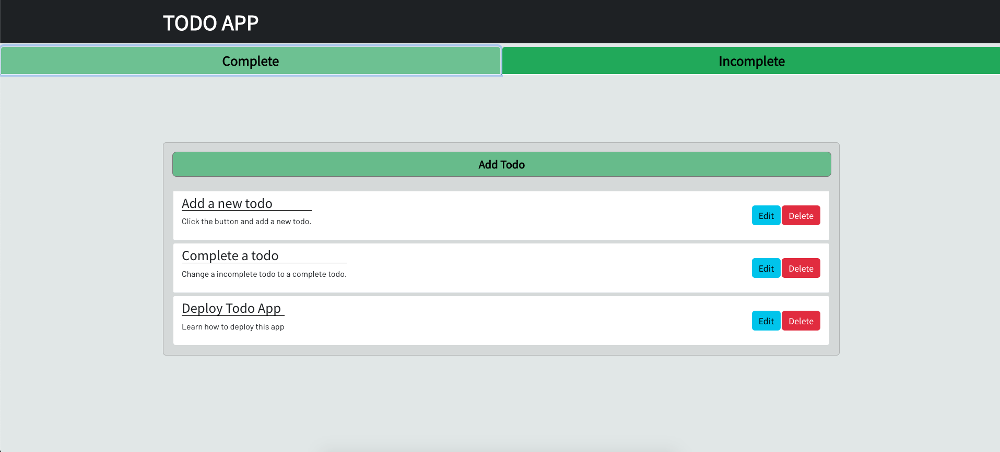

# Python Todo App

## Overview

A simple CRUD todo app built with Django, React, and deployed with Heroku. This app allows users to create, edit, and delete a todo which is all handled on the Django backend and served to the React.js frontend.

### Future Development

Add a Auth system to allow users to create accounts and login so they can make their own personal todos instead of a community todo list. 

## Tech Stack

- Python
- Django
- Node.js
- React.js
- Bootstrap 
- Heroku
- CSS
- Google Fonts

## Link to Site

Try it out for yourself! 

https://python-todo.herokuapp.com/

### Or run locally 

If the link is not working its becausing I'm not paying for the dyno :(

Start by cloning the repo!

Install nesseary dependencies by running: 

```
npm install
```
```
pip install pipenv
pipenv shell
pipenv install 
```

Then in one terminal run: 
```
npm start
```

And in another terminal run:
```
python manage.py runserver
```

It should now be running locally. 


